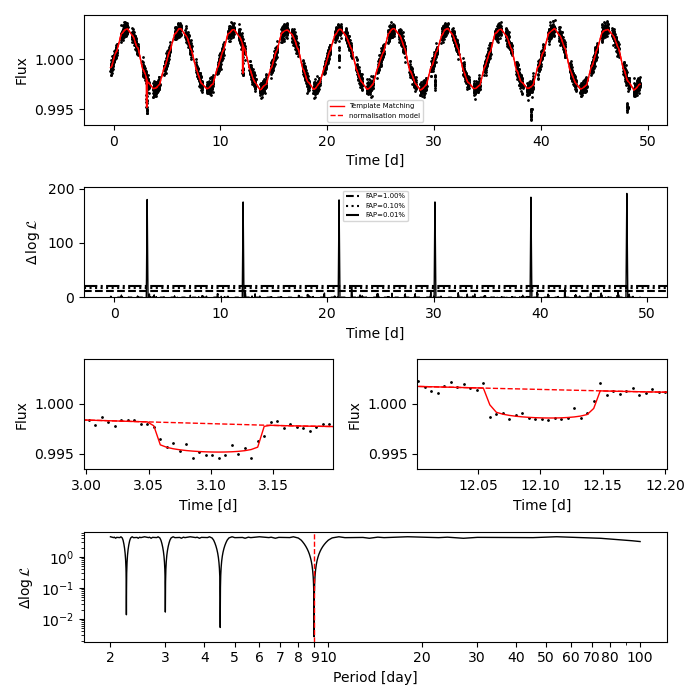
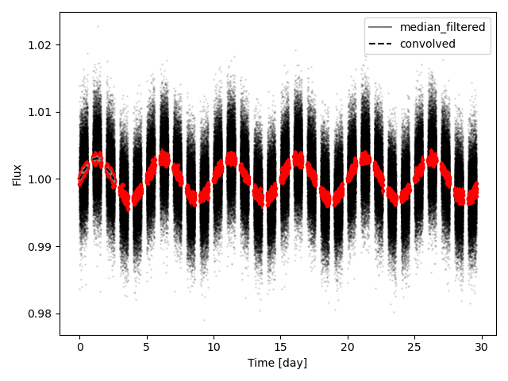

# BRUCE
------------------
<table border="0">
 <tr>
    <td>Lightning-fast binary star model and data reduction package. This package uses the Numpy C API and OpenMP to create an incredibly fast and optimised suite of tools for the reduction and analysis of exoplanets and stellar binaries.</td>
    <td> </a> </td>
 </tr>
</table>

## Binary star model
---------
The binary star model described here is heavily influenced by [ellc](https://github.com/pmaxted) [(Maxted 2016)](https://www.aanda.org/articles/aa/full_html/2016/07/aa28579-16/aa28579-16.html) and credit should be given to this work for the functions used in this package related to solving for the mean, eccentric, and true anomaly, along with functions for the scaled orbital separation and radial velocities (this list is not exhaustive). The transit model used here is called qpower2 [Maxted and Gill 2016](https://ui.adsabs.harvard.edu/abs/2019A%26A...622A..33M/abstract) and uses the power-2 limb-darkening law. People are encouraged not to fit the limb-darkening coefficients directly but rather to use the decorelated parameters h1 and h2 described in [Maxted 2018](https://ui.adsabs.harvard.edu/abs/2018A%26A...616A..39M/abstract).

Most functions in this package depend on a numpy array as an input and are written to expect double precision data (np.float64). Care has been taken to recast data where appropriate in the C code to avoid errors where the data is not of type np.float64, but this comes at a cost to performance. For best results, use np.float64 throughout (data, input models, etc.). The C source code uses OpenMP to multiprocess calculations where appropriate. To control this, set the OMP_NUM_THREADS environmental variable to the number of processors you wish to use. If fitting data using multiprocessing, you may encounter forking issues, and so I would suggest setting this to 1 prior to fitting.

```bash
export OMP_NUM_THREADS=12
```


Only a few functions exposed to use, but should be everything needed to model a binary star/exoplanet system. Lets star with generating a lightcurve model which is wrapped into one call.
```python
bruce.binarystar.lc(t = np.linspace(-0.2,0.2,100),flux=None, flux_err=None,
        t_zero=0., period = 1.,
        radius_1=0.2, k = 0.2, incl=np.pi/2,
        e=0., w = np.pi/2.,
        c = 0.7, alpha = 0.4,
        cadence=0, noversample=10,
        light_3=0.,
        ld_law = 2,
        accurate_tp=0,
        jitter=0., offset=0)
```
If flux and flux_err are provided, the log-likliehood is returned instead of the lightcurve model. The parameters jitter allows the user to add additional uncertainty in quadrature to flux_err while offset removes an arbritrary large constant if set to 1.  This function exploits OpenMP to calcualate/evaluate the model faster. It's much faster to call this function with t, flux, and flux_err to get the log-likliehood than getting the model and calculating it seperately. Note also that you can specify the cadence (in days) which will cadence smear the model, if required. Next, we can look at radial velocities:
```python
bruce.binarystar.rv1(t = np.linspace(0,1,100),rv=None, rv_err=None,
        t_zero=  0., period = 1.,
        K1 = 1., e = 0.,  w = np.pi / 2.,
        V0 = 0., incl = np.pi / 2.,
        accurate_tp=0,
        jitter=0., offset=0)
```
This provides the spectroscopic reflex motion of the primary star, normalised in units of the semi-amplitude, K1. Like the lc call, if data is provided through rv and rv_err, a log-likliehood value is returned. If double-lined binaries are your game, the spectroscopic reflex motion of the secondary can easily calculated as the true anomaly for the primary star is that of the secondary plus pi. We provide utility to do this:
```python
rv2(t = np.linspace(0,1,100),rv1=None, rv1_err=None,rv2=None, rv2_err=None,
        t_zero=  0., period = 1.,
        K1 = 1., K2=1.,
        e = 0.,  w = np.pi / 2.,
        V0 = 0., incl = np.pi / 2.,
        accurate_tp=0,
        jitter=0., offset=0)
``` 
When rv1 and rv2 is not given, the RV models are returned for the primary and secondary. When data is given, the log-likliehood is returned like lc and rv1. 

------------------
## Template Matching

One of the main uses for bruce is to search for additional transits in additional photometric data where you know the transit shape from an original set (e.g. TESS signle transit candidate). We have developed an algorithm to do just this (Gill+2025 in prep) and can be easily achieved like this
```python
time_trial, DeltaL = bruce.template_match.template_match_lightcurve(t, f, fe, w, period = period,
        radius_1=0.03, k = 0.05, incl=np.pi/2,
        e=0., w = np.pi/2.,
        c = 0.7, alpha = 0.4,
        cadence=5, noversample=10,
        light_3=0.,
        ld_law = -2,
        accurate_tp=1,
		jitter=0., offset=0,
		time_step=None, time_trial=None)
```
By simple passing the data, along with parameters used to fit a single transit (period, R1/a, R2/R1, and incl) you can search each possible epoch for signs of a transit. In return, you get time_trial (the epochs we try) and DeltaL, the delta log-likliehood of a match at this position. Epochs where DeltaL > 0 mean the transit model is favoured over a null model. You can then look for peaks in DeltaL which are significant (which you can define) like this.

```python
# Get the FAP heights for 1%, 0.1%, and 0.001% 
probabilities, heights = bruce.template_match.get_delta_loglike_height_from_fap(p_value=[0.01,0.001,0.0001], df=3) 

from scipy.signal import find_peaks
peaks, meta = find_peaks(DeltaL, height=heights[2])
```
Once you have found viable events (time_trial[peaks[0]], time_trial[peaks[1]], ... and so on), you can use a modified version of the phase dispersion algorithm to estimate the true orbital period:
```python
periods = np.linspace(2,100,100000)
dispersion = bruce.template_match.phase_disperison(time_trial, peaks,  periods)
period_best = periods[np.argmin(dispersion)]
```

The normalisation model, w, can be whatever you want, but we provide a median filter and a convolution filter to use if you so wish. 
```python
w = bruce.data.median_filter(t,f, 0.2)
w = bruce.data.convolve_1d(t,w,0.2) # Should you wish to smooth the output
```
Its worth noting that the quality of your results can be pretty dependent on the normalisation model, but iof you get it right, the result can be pretty cool.


------------------
## Data processing

We provide a small few packages to help process data. The first is  to efficiently bin data given a bin width. By making a call like this,
```python
time_binned, flux_binned, flux_err_binned = bruce.data_processing.bin_data(time, flux, bin_size=0.5/24/3)
```
We get fast and efficient binned data.
</a>
We also provide functions to normalise and flatten data. I provide a median filter and a 1-d convolution that works in time, not data index:
```python
flux_median_filter_10min = bruce.data_processing.median_filter(time, flux, bin_size=0.5/24/3)
flux_convolved_10min = bruce.data_processing.convolve_1d(time, flux, bin_size=0.5/24/3)
```

-----------------

## Performance

Most functions are expecting contigeous numpy arrays of type np.float64. If not, they will be re-cast in the C-code which ultimately yields a performance penalty. 

If you want to use only a single core, you will have to set the OMP_NUM_THREADS enviroment variable whoch controls the number of processes used for parallel regions of the C code. If you are fitting these functions using multiprocesing, it is advised you set this to 1. 